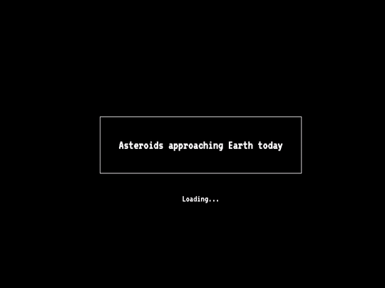

# Asteria - Asteroids approaching Earth today

[See live](https://asteria-gccgo.mongodbstitch.com/)

This project was built for [MongoDB Atlas](https://docs.atlas.mongodb.com/)
Hackathon. Atlas function uses [NASA API](https://api.nasa.gov/) to fetch list
of approaching near-Earth objects, transforms them to a more appropriate form
and upserts them to a MongoDB collection.

Using generated GraphQL schema, data is queried from a minimalistic web page:

